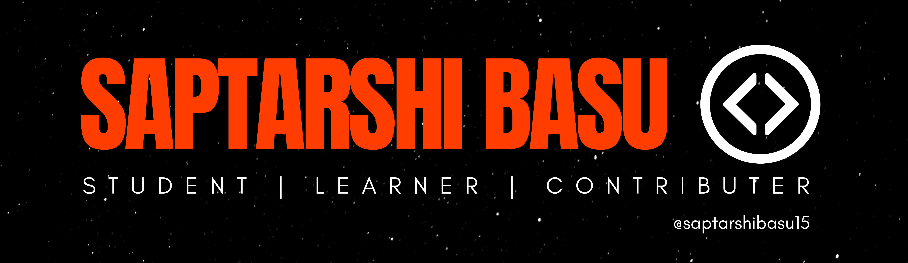

## Hi fellas! , 

I'm **Saptarshi Basu** A.K.A **[@Coding Verse](https://www.instagram.com/codingverse/)**, I'm 15, an aspiring software engineer 👨‍💻 who is passionate about mobile technologies, open source & programming. I'm also a self proclaimed graphic designer and internet surfer 
🏄‍♂️. 

- 🔭 I’m currently working on solutions to make students' lives and academics more efficient, easy and ***COOL***.
- 🌱 I’m currently learning Native app development.
- 💬 Ask me about: tech, memes, anime
- 😄 Pronouns: he/him
- ⚡ Languages: Java, C/C++, Python3, JavaScript

## 🏓 Get In Touch On ...

## 🔧 Technologies & Tools ...

## 📈 Github Stats ... 

> El Psy Kongroo

---
⭐️ From [Saptarshi Basu](https://github.com/saptarshibasu15)
